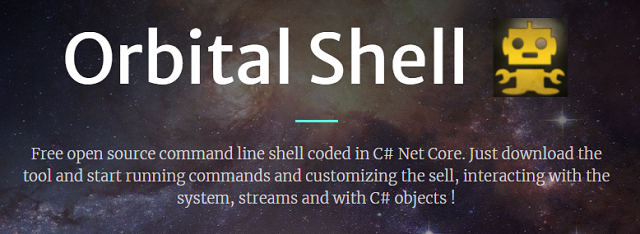

# Orbital-Shell-WebSite



The web site is powered by **linux Alpine** , **ruby** and **Jekyll**. The common and easy way to use this it is to run a **bretisher** docker image, that is available at:
https://hub.docker.com/r/bretfisher/jekyll-serve


## To get the web site running in a development environment, follow these steps:

👉 For doing that, you will need **docker desktop** (docker+docker compose) installed in your OS.

#### 1. Get the docker image of Jekyll Web server full stack:

```shell
docker pull bretfisher/jekyll
```

#### 2. Clone the repository

```shell
cd MyProjects
git clone https://github.com/OrbitalShell/OrbitalShell.git
```

#### 3. Run the web site from the docker container

```shell
docker run -p 8080:4000 -v "[PATH_TO_THE_WEBSITE_REPO]/docs:/site" bretfisher/jekyll-serve

# example :
# docker run -p 8080:4000 -v "C:/Users/franc/Documents/ORBITAL-SHELL/Orbital-Shell-WebSite/docs:/site" bretfisher/jekyll-serve
```

#### 4. The web site is now available at: http://localhost:8080/OrbitalShell/


##### you can observe the running container:

```shell
docker stats
```
##### and live edit the web site and further commit to the repository

